# FarmTrack

Manage your farms and animals easily and efficiently with FarmTrack - the complete application for registration and agricultural control.


## Description

FarmTrack is a practical and intuitive application for registering farms and managing animals. With FarmTrack you can easily register and keep track of all your farms, as well as create a complete list of animals on each one. Easily organize and access your farms' essential data, all in one place. Simplify your agricultural management work with FarmTrack and have efficient control over your rural activities.

### Features

- Register multiple animals for each farm
- Farm list with number of animals
- Data updates automatically
- Dark theme


## Description

This project was built using the MVVM architecture with layers of Services and Repositories along with dependency injection.

The following graphic representation exemplifies the use of the mentioned layers
previously in conjunction with the MVVM architecture.

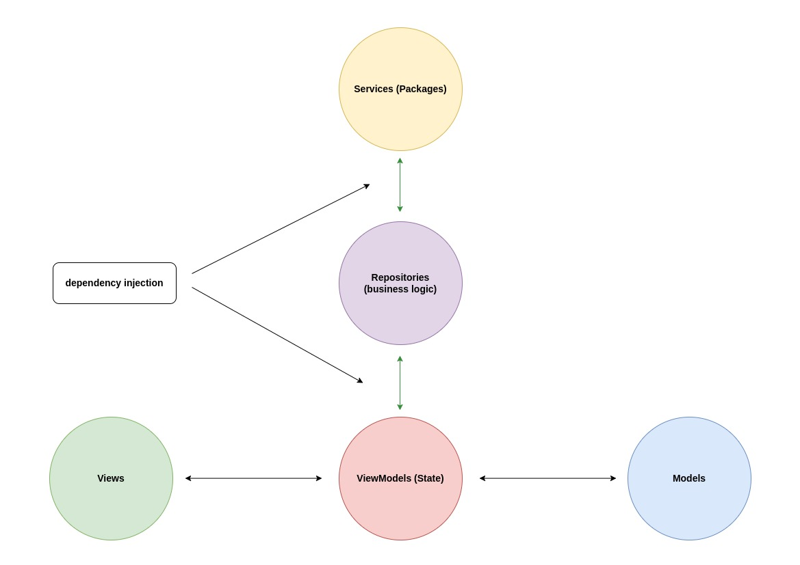

Therefore, with the use of these three functionalities in the project and through dependency injection, it is possible to inject the service layer into the classes that need to access external resources and the repository layer into the classes that need the data provided by the service layer. In this way, it is possible to separate the responsibilities of each layer and make the code more modular and easier to test.


## ScreenShots

| Image 1 | Image 2 | Image 3 |
|----------|----------|----------|
|  | 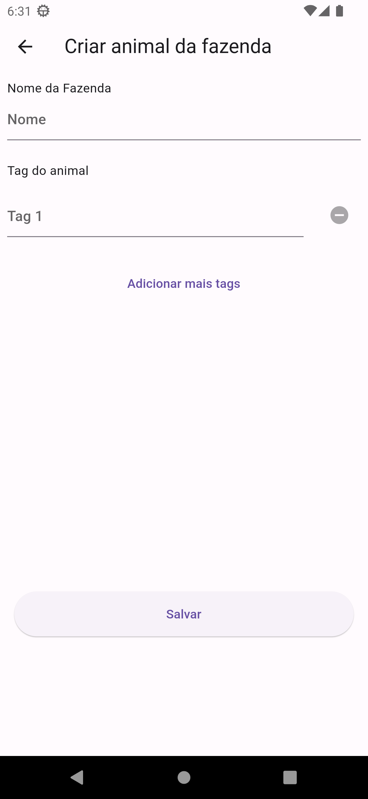 | 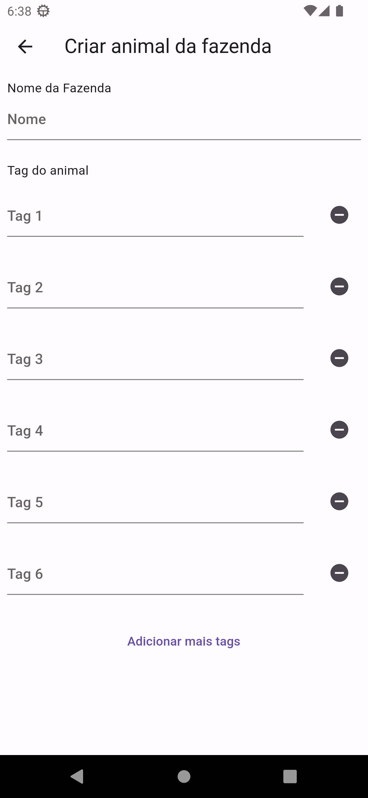 |

| Image 4 | Image 5 | Image 6 |
|----------|----------|----------|
| 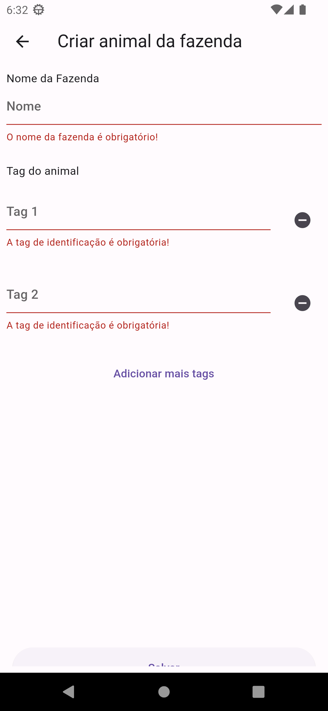 | 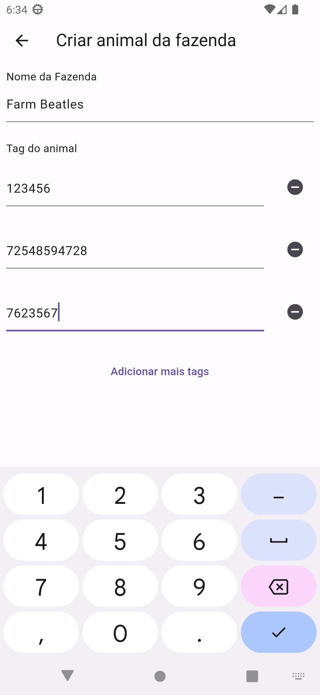 | 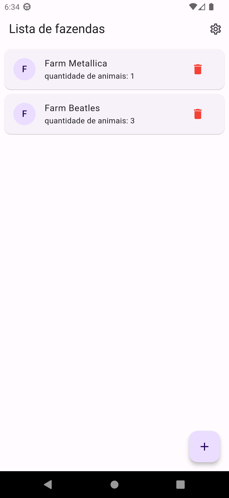 |

| Image 7 | Image 8 | Image 9 |
|----------|----------|----------|
| 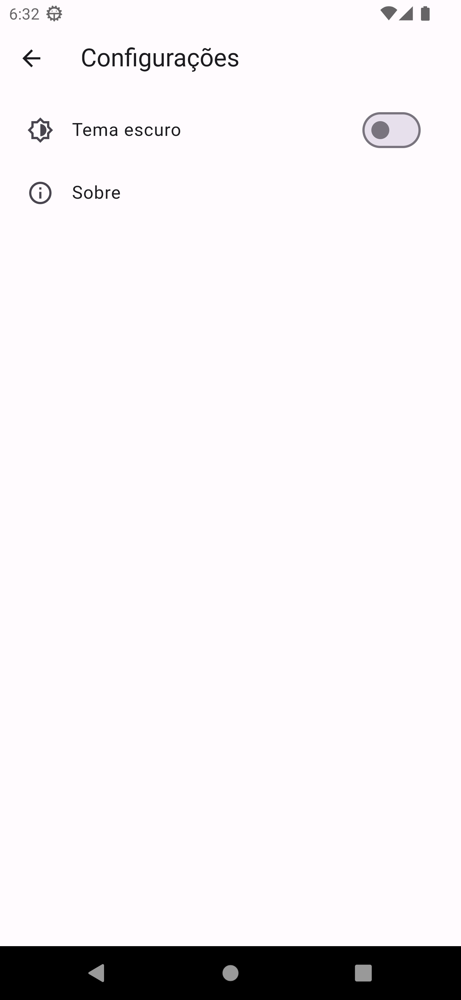 | 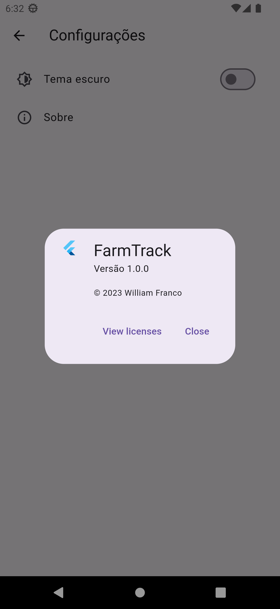 | 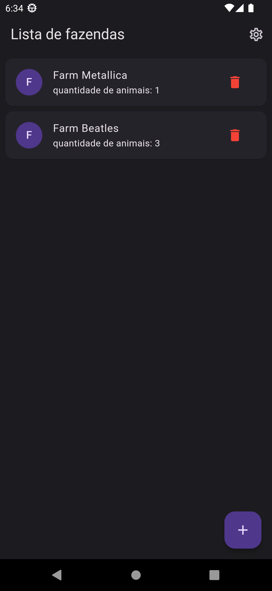 |

| Image 10 | Image 11 | Image 12 |
|----------|----------|----------|
| 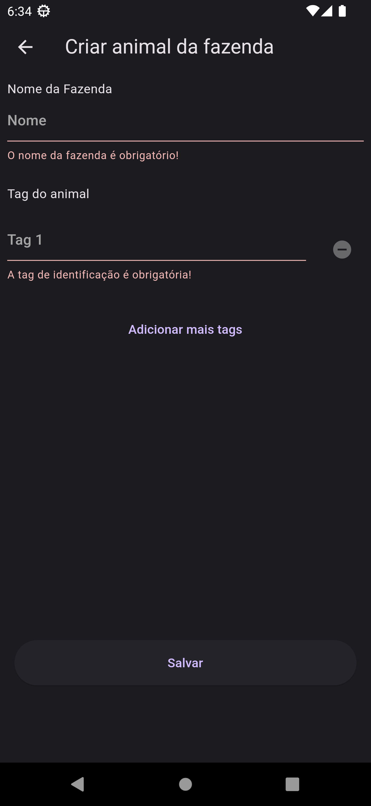 | 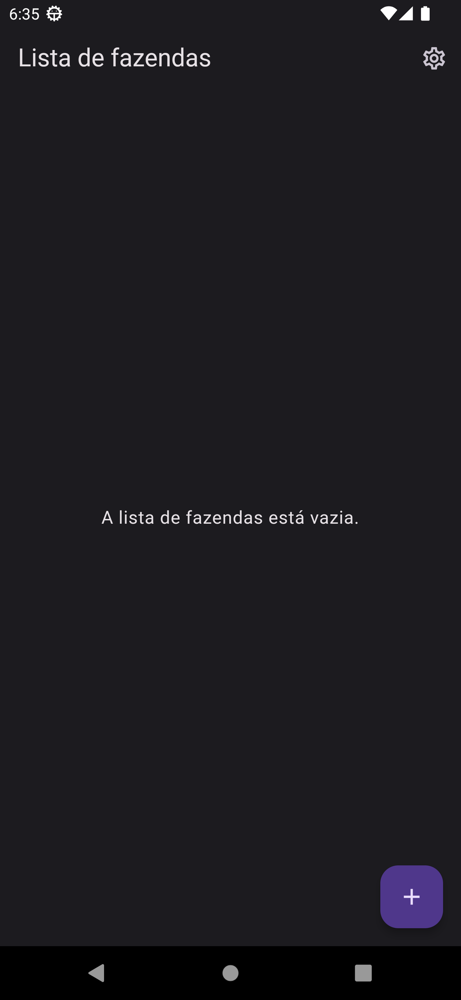 | 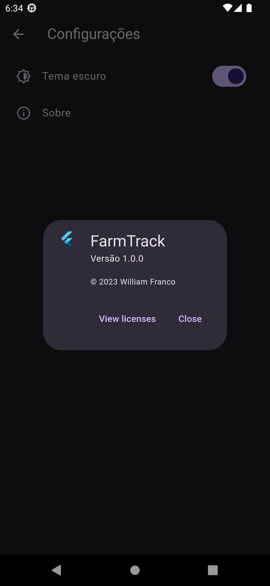 |


## Models

Models were created using [JSON to Dart](https://javiercbk.github.io/json_to_dart/).


## Scripts

### Build Runner

```
flutter clean && flutter pub get && flutter pub run build_runner watch --delete-conflicting-outputs

flutter clean && flutter pub get && flutter pub run build_runner build --delete-conflicting-outputs
```

### Import Sorter

```
flutter pub run import_sorter:main lib\/* test\/*
```


## Author

William Franco (Dev mobile).


## License

MIT License

Copyright (c) 2023 William Franco

Permission is hereby granted, free of charge, to any person obtaining a copy of this software and associated documentation files (the "Software"), to deal in the Software without restriction, including without limitation the rights to use, copy, modify, merge, publish, distribute, sublicense, and/or sell copies of the Software, and to permit persons to whom the Software is furnished to do so, subject to the following conditions:

The above copyright notice and this permission notice shall be included in all copies or substantial portions of the Software.

THE SOFTWARE IS PROVIDED "AS IS", WITHOUT WARRANTY OF ANY KIND, EXPRESS OR IMPLIED, INCLUDING BUT NOT LIMITED TO THE WARRANTIES OF MERCHANTABILITY, FITNESS FOR A PARTICULAR PURPOSE AND NONINFRINGEMENT. IN NO EVENT SHALL THE AUTHORS OR COPYRIGHT HOLDERS BE LIABLE FOR ANY CLAIM, DAMAGES OR OTHER LIABILITY, WHETHER IN AN ACTION OF CONTRACT, TORT OR OTHERWISE, ARISING FROM, OUT OF OR IN CONNECTION WITH THE SOFTWARE OR THE USE OR OTHER DEALINGS IN THE SOFTWARE.

